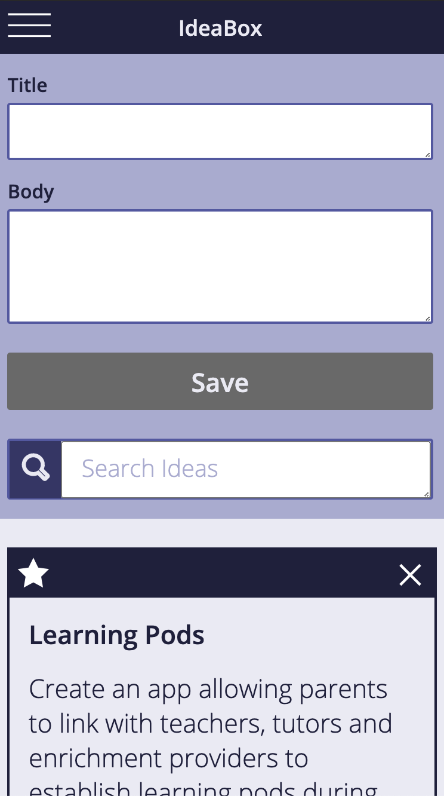
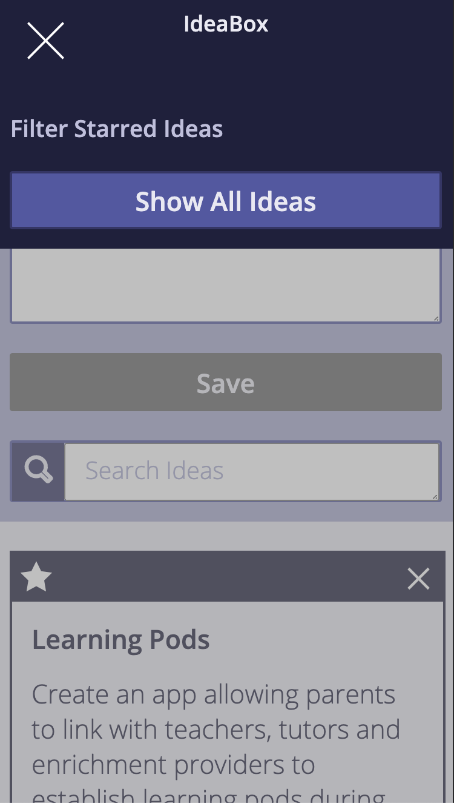
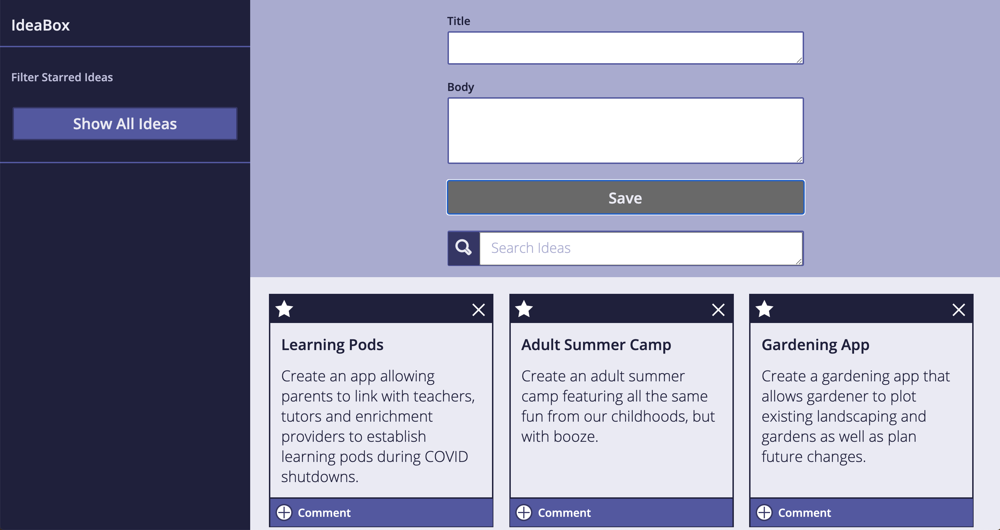

# Ideabox Group Project

Every developer has more ideas than time. As David Allen likes to say "the human brain is for creating ideas, not remembering them." In this project, we built an application that allows a user to record and archive their ideas (good and bad alike).

Throughout the project, one of our focuses was on providing a fluid and responsive client-side interface. To this end, we relied on JavaScript, implemented snappy filtering in the browser, and `localStorage` to persist our wonderful ideas between sessions. HTML and CSS were utilized to provide structure and styling to the page. 

Our final result is an application that allows a user to create an "Idea Card," store the card, "favorite" the card, display the favorites, search the collection of cards based on user-defined search terms, and delete the idea from the collection. This is responsive on mobile, tablet and desktop screens. 

## Learning Goals

### Group Learning Goals

* Continue to improve on building responsive client-side applications with good user feedback
* Understand how to implement client-side data persistence using `localStorage`
* Understand what it looks like to have a separate data model (using a class) and DOM model
* Utilize `data-*` attributes
* Incorporate & iterate over arrays in order to filter what is being displayed
* Craft code with clean style, using small functions that show trends toward DRYness and SRP

### Individual Learning Goals

* Caleb: Gain a deeper understanding with CSS.
  * Result: I feel as though I have a strong understanding of CSS, it's formatting, conventions, and implementation. I can implement flex-box and grid, and I know the different applications of each.

* Mike: Interacting HTML with JS. Continuing to understand DRY code. Using Style Guide for HMTL.
  * Result: Personally, I had a ton of growth in this project from the last project in the HTML as well as CSS and JS. I Also, I found that I had a new goal which was to understand localStorage. I think the pre-lesson that we did with my mentor, Nathaniel, although rough went a long way in my understanding during the in-class lesson on localStorage. We also got to play with a ton of event bubblin’ which helped me grasp the concept a lot more on how to best interact with HTML and JS. I also had a big lesson on letting code go that I held near to me in respect for code that was cleaner and much more DRY.

* Stacy: Continue to work toward understanding DRY code. Gain deeper understanding HTML/CSS. Improve Git Workflow habits.
    * Result: I definitely feel like I have gained more automaticity with the Git Workflow. My commits on this project were much more meaningful and frequent than past projects. We also experienced our first merge conflict on this project, so it was helpful to see how that process works. I really enjoyed gaining more skills with HTML/CSS. Particularly with CSS, being able to add visually interesting features like different cursor types and hover states was fun. I think DRY code will always be a work in progress to some degree, but I definitely feel more able to recognize redundancies and refactor them after this project. I also recognize the necessity on occasion to get something to work first and then refactor it so it's DRY later. As always, there were also learning points with the new concepts introduced in the project like event bubbling and localStorage.

## Overview of Technology Used

### Workflow Tools Used

* A DTR was established to set group norms and expectations. (link here)
* Wireframe(https://i.imgur.com/JTflp1L.png)
* GitHub was used to host our project repository and allow us to share and review code.
* Slack, Tuple and Zoom were all used for group communication and meetings. 

### Programmming Technology

* HTML
  * Used to provide the general structure of our website
  * Challenges: 
    * The original link for the font provided in the comp wasn't quite as functional as we would have liked. 
    * There were a couple challenges with hidden classes and getting them to work properly between the CSS/HTML.
    * Accessing both Show Starred Idea buttons to make changes via innerText was a challenge initially. 
  * Wins: 
    * We searched up a better link for the font that enabled us to have the styling we wanted in CSS. 
    * Ordering our HTML properly and using wrappers helped up get the header/nav section to render properly in both the mobile and desktop views. 
    
* CSS 
  * Used to provide styling to our website. 
  * Challenges: 
    * Understanding which colors to use where based on the comp was at times tricky. 
    * Getting the gray overlay to extend the length of the screen on mobile view was a challenge. 
    * Disabling the save button was a new skill.  
  * Wins:
    * We enjoyed adding visually interesting features to our styling like hover states and cursor types. 
    * Ultimately, we made our best guess at the colors and think it is a faithful rendering. 
    * The disabled save button was conquered and we can add that to our toolbox of skills. 
    * The gray overlay taught us about position: fixed. 
    
 * JavaScript
   * Used to provide functionality and localStorage to our website.
   * Challenges: 
     * LocalStorage was a serious challenge. We had to ultimately nuke some code and rewrite it. Conceptually, we understood it, but the      implementation definitely got hairy.
     * At first, we thought the functionality of favoriting cards seemed simple, but it turned out to be a meatier challenge than we were expecting.     
   * Wins: 
     * Ultimately, localStorage was a success! Having to nuke that code taught us a number of lessons (advocate for your learning, code isn't precious) and it wasn't easy, but the code works and our knowledge has leveled up. 
     * A few different functions to handle the favoriting process enabled the star icon to function for the user and simplify the process of favoriting and storing those ideas. 

## Provided Comp

Full Mobile Layout:

Full Mobile Layout with Open Navigation:

Desktop Layout:

## Site Tour

### Responsive Views

Full Mobile Layout:

Full Mobile Layout with Open Navigation:

Desktop Layout:

Responsiveness in Action: 

### Creating an Idea Card

Create an Idea Card

### Delete a Card

Delete a Card

### Search Cards

Search Cards based on User Input

### Show Starred Ideas

Show Starred Ideas

## Team Contributions

### Project Lead 

* Scott Ertmer, https://github.com/sertmer

### Team Members

* Caleb Cyphers, https://github.com/CalebCyphers
* Stacy Potten, https://github.com/stacyp2006
* Michael Walker, https://github.com/MichaelEWalker87

### Mentors Consulted

All mentors were on calls with us as we planned, problem-solved, coded, debugged, and refactored. All mentors reviewed code in some way and changes were made based on that feedback. 

* Maria St. Louis-Sanchez, Stacy's mentor
* Johnny Cassidy, Caleb's mentor
* Nathaniel Foster, Mike's mentor
* John Adams, Student Support, assigned to Stacy

### Coheart Members Consulted

* Ian Holladay, GitHub Firefighter
* Nathan Darrington, LocalStorage Tour Guide
* Orlando Murcio, Array Promoter
* Matthew Lane, DeleteFromStorage Guru

